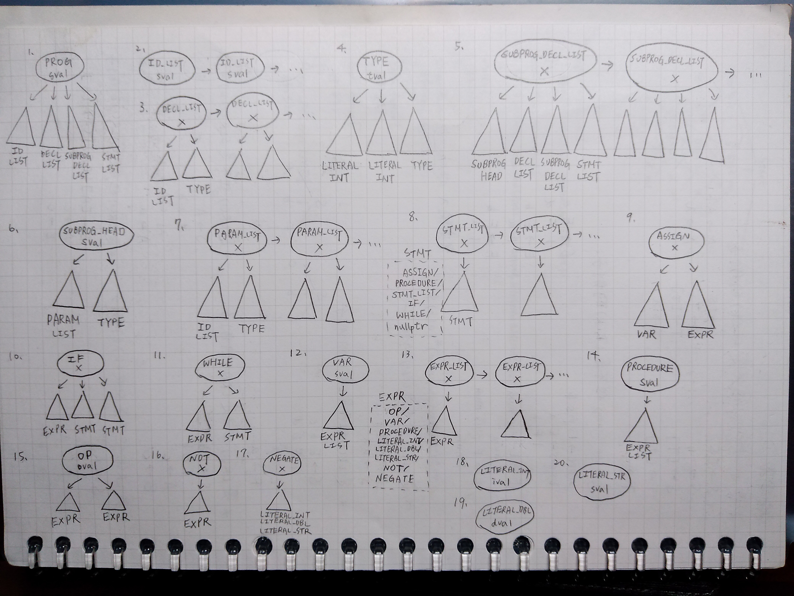

# mini-pascal-compiler
NYCU 2022 Fall "Introduction to Compiler Design" Final Project

## Build
```bash
make
```

## Generate JVM Assembly
```bash
make gen
```
The result is placed in `testcases/*.j` and can be further converted to binary Java class files via [Jasmin](https://jasmin.sourceforge.net/).

## AST

